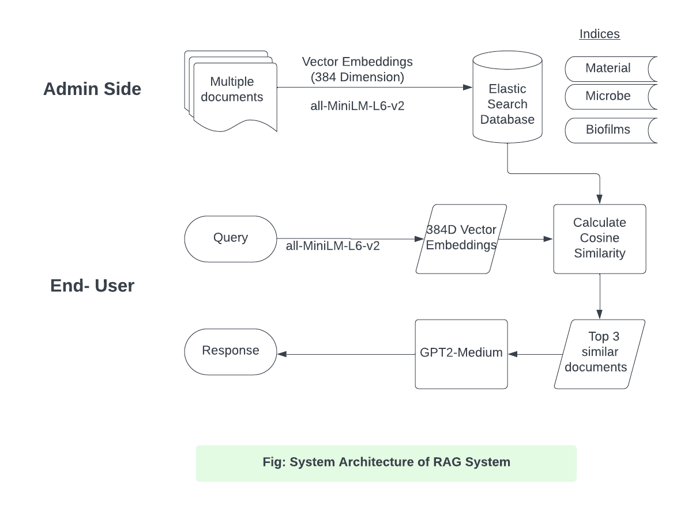
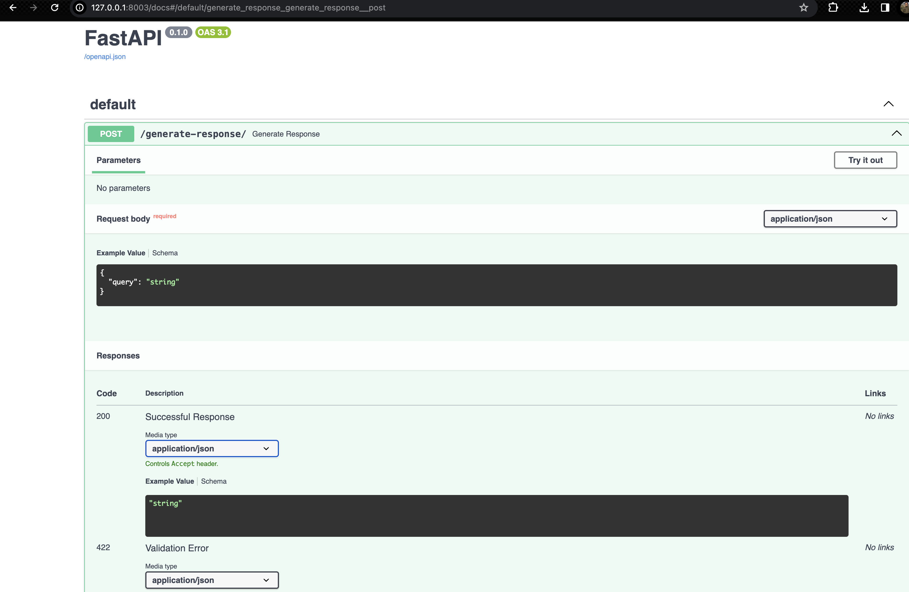
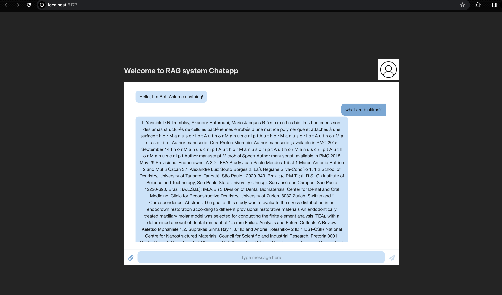

# Corrective Retrieval Augmented Generation
Corrective Retrieval-augmented generation is a technique in machine learning that enhances text generation by evaluating and correcting the quality of information retrieved from external sources, thereby improving the accuracy and relevance of the generated content.


You can find the detail explanation of architecture [here.](./assets/CRAG.pdf)

# Overview of repository
Here, A chatbot was created, incorporating a Retrieval-Augmented Generation (RAG) System that combines correction mechanisms tailored for three specific domains: material, microbe, and biofilms. For each of these domains, 20 papers were sourced from [PubMed](https://pubmed.ncbi.nlm.nih.gov/) as of now in demonstration, later on we can source more at ease. The use of Large Language Models (LLMs) was employed without any restrictions, enabling the leveraging of advanced natural language processing capabilities to interpret and respond to user queries effectively.

The front-end of the system was designed in a chatbot style to facilitate conversation, providing users with an interactive and engaging interface. To support this, preferred frameworks such as Elasticsearch is used for efficient data retrieval, and React is used for building a dynamic user interface were utilized. This comprehensive approach ensured that the chatbot was not only functional but also user-friendly and scalable, capable of handling queries.

### Requirements

```sh
Python v3.9 (*)
Elasticsearch v8.12.1 (*)
```

### Installation Guide

### Guideline for Indexing Documents
prerequisites: Before running the script, create folders inside `./documents` named biofilms, microbe, material and add pdf files that you want to index inside each folder.cThen run following script to get text content from those pdfs.
```sh
    python text_extractor.py
```
This will create folder named texts inside each subdirectories of './documents' where you can replace all .txt files of each texts folder to one level of directory outward by removing pdf files in each subdirectories of `./documents`. 


To create indices of elasticsearch. First run the elasticsearch server on your device. See official documentation. [Here](https://www.elastic.co/guide/en/elasticsearch/reference/current/starting-elasticsearch.html).

After successful elasticsearch setup on your device which runs at port 9200. Run this script.
```sh
    python elasticindexcreater.py
```

Now, You can run this project by installing the packages and dependencies 
- Copy `.env-helper` to `.env` and configure the environment variables

To run the fast api server,
```sh
    python -m venv env 
    source env/bin/activate
    pip install -r requirements.txt
    uvicorn api:app --reload
```
Note:  Application runs at default port 8000


### API Documentation
You can refer to the fast api documentation that uses openapi 3.0 at the following link
[Swagger Documentation for Fast API.](http://localhost:8080/docs).
i.e. http://thisapphost.com/docs


You will get above swagger docs for your reference after visiting the documentation url.


### Client-Side UI (React App)

You can access the client side application made with React JS by accessing `./client` folder and by running the application.
Also, you can find the [Readme.md for React Application](./client/README.md) which guides you through the process to install application locally.

